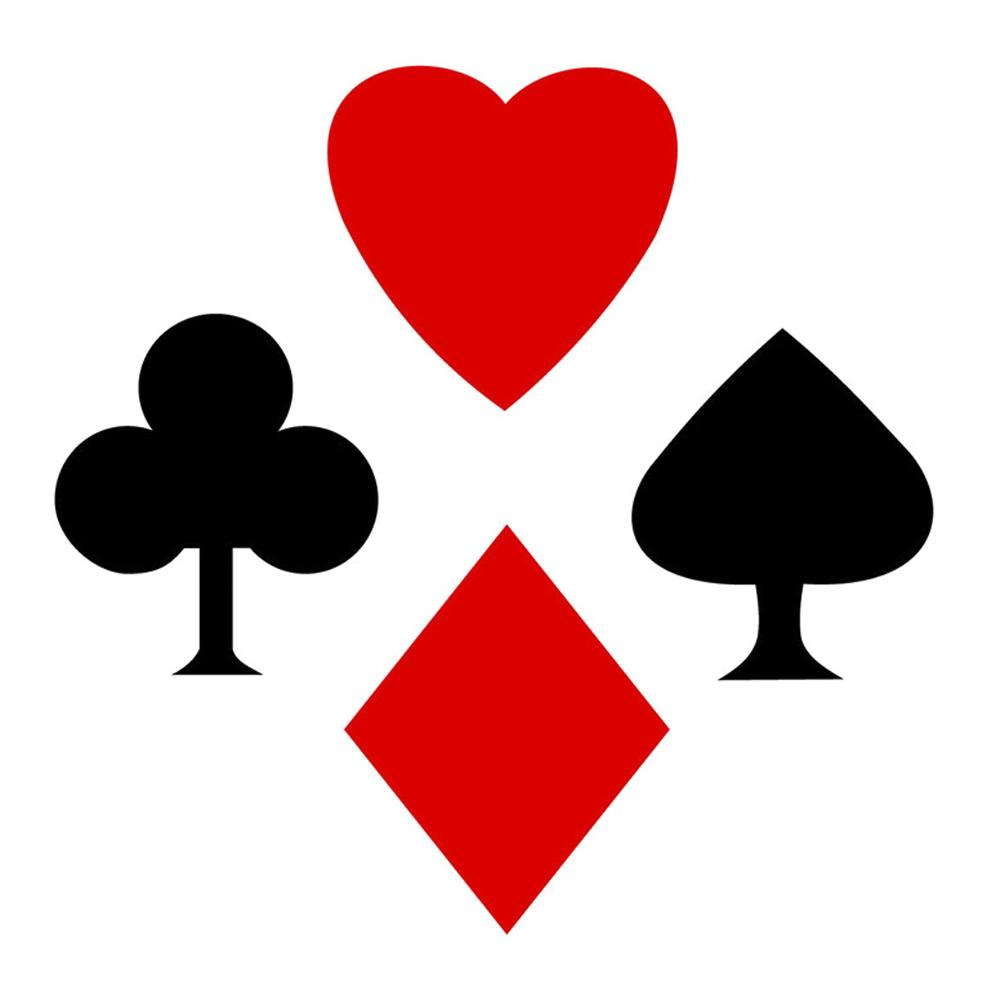

### Dados da Partida de 14-12-2018:
#### Jogadores: 
1. `Alexandre`
2. `Christian`
3. `Edwaldo`

#### Baralho: 
- TRES - PAUS
- CINCO - PAUS
- OITO - COPAS
- OITO - OUROS
- SEIS - PAUS
- SETE - COPAS
- NOVE - PAUS
- VALETE - OUROS
- OITO - PAUS
- CINCO - OUROS
- SEIS - OUROS
- SETE - OUROS
- QUATRO - ESPADAS
- SEIS - ESPADAS
- AS - PAUS
- DOIS - OUROS
- AS - OUROS
- QUATRO - PAUS
- REI - PAUS
- OITO - ESPADAS
- REI - OUROS
- REI - COPAS
- DAMA - OUROS
- TRES - COPAS
- DAMA - COPAS
- CINCO - ESPADAS
- REI - ESPADAS
- NOVE - OUROS
- AS - ESPADAS
- TRES - OUROS
- DOIS - ESPADAS
- DEZ - COPAS
- VALETE - PAUS
- VALETE - COPAS
- DEZ - PAUS
- QUATRO - OUROS
- QUATRO - COPAS
- NOVE - ESPADAS
- SETE - ESPADAS
- DAMA - ESPADAS
- AS - COPAS
- DAMA - PAUS
- SETE - PAUS
- DEZ - ESPADAS
- DEZ - OUROS
- VALETE - ESPADAS
- DOIS - PAUS
- NOVE - COPAS
- CINCO - COPAS
- DOIS - COPAS
- TRES - ESPADAS
- SEIS - COPAS

#### Jogadas da Partida: 
- **Alexandre** colocou TRES - PAUS no seu Monte
- **Christian** colocou CINCO - PAUS no seu Monte
- **Edwaldo** colocou OITO - COPAS no seu Monte
- **Alexandre** roubou monte do `Edwaldo` com OITO - OUROS
- **Alexandre** colocou SEIS - PAUS na área de descarte
- **Christian** colocou SETE - COPAS na área de descarte
- **Edwaldo** colocou NOVE - PAUS na área de descarte
- **Alexandre** colocou VALETE - OUROS na área de descarte
- **Christian** roubou monte do `Alexandre` com OITO - PAUS
- **Christian** colocou CINCO - OUROS na área de descarte
- **Edwaldo** pegou carta da área de descarte com SEIS - OUROS
- **Edwaldo** pegou carta da área de descarte com SETE - OUROS
- **Edwaldo** colocou QUATRO - ESPADAS na área de descarte
- **Alexandre** colocou SEIS - ESPADAS na área de descarte
- **Christian** colocou AS - PAUS na área de descarte
- **Edwaldo** colocou DOIS - OUROS na área de descarte
- **Alexandre** pegou carta da área de descarte com AS - OUROS
- **Alexandre** pegou carta da área de descarte com QUATRO - PAUS
- **Alexandre** colocou REI - PAUS na área de descarte
- **Christian** colocou OITO - ESPADAS no proprio monte
- **Christian** pegou carta da área de descarte com REI - OUROS
- **Christian** colocou REI - COPAS no proprio monte
- **Christian** colocou DAMA - OUROS na área de descarte
- **Edwaldo** colocou TRES - COPAS na área de descarte
- **Alexandre** pegou carta da área de descarte com DAMA - COPAS
- **Alexandre** pegou carta da área de descarte com CINCO - ESPADAS
- **Alexandre** roubou monte do `Christian` com REI - ESPADAS
- **Alexandre** pegou carta da área de descarte com NOVE - OUROS
- **Alexandre** colocou AS - ESPADAS na área de descarte
- **Christian** pegou carta da área de descarte com TRES - OUROS
- **Christian** pegou carta da área de descarte com DOIS - ESPADAS
- **Christian** colocou DEZ - COPAS na área de descarte
- **Edwaldo** pegou carta da área de descarte com VALETE - PAUS
- **Edwaldo** colocou VALETE - COPAS no proprio monte
- **Edwaldo** pegou carta da área de descarte com DEZ - PAUS
- **Edwaldo** colocou QUATRO - OUROS na área de descarte
- **Alexandre** pegou carta da área de descarte com QUATRO - COPAS
- **Alexandre** colocou NOVE - ESPADAS na área de descarte
- **Christian** colocou SETE - ESPADAS na área de descarte
- **Edwaldo** colocou DAMA - ESPADAS na área de descarte
- **Alexandre** pegou carta da área de descarte com AS - COPAS
- **Alexandre** pegou carta da área de descarte com DAMA - PAUS
- **Alexandre** pegou carta da área de descarte com SETE - PAUS
- **Alexandre** roubou monte do `Edwaldo` com DEZ - ESPADAS
- **Alexandre** colocou DEZ - OUROS no proprio monte
- **Alexandre** colocou VALETE - ESPADAS na área de descarte
- **Christian** colocou DOIS - PAUS no proprio monte
- **Christian** pegou carta da área de descarte com NOVE - COPAS
- **Christian** colocou CINCO - COPAS na área de descarte
- **Edwaldo** colocou DOIS - COPAS na área de descarte
- **Alexandre** colocou TRES - ESPADAS na área de descarte

#### Final da Partida: 
##### Monte do Alexandre:
- DEZ - OUROS
- DEZ - ESPADAS
- DEZ - PAUS
- DEZ - COPAS
- VALETE - COPAS
- VALETE - PAUS
- VALETE - OUROS
- SETE - OUROS
- SETE - COPAS
- SEIS - OUROS
- SEIS - PAUS
- SETE - PAUS
- SETE - ESPADAS
- DAMA - PAUS
- DAMA - ESPADAS
- AS - COPAS
- AS - ESPADAS
- QUATRO - COPAS
- QUATRO - OUROS
- NOVE - OUROS
- NOVE - PAUS
- REI - ESPADAS
- REI - COPAS
- REI - OUROS
- REI - PAUS
- OITO - ESPADAS
- OITO - PAUS
- OITO - OUROS
- OITO - COPAS
- TRES - PAUS
- CINCO - PAUS
- CINCO - ESPADAS
- CINCO - OUROS
- DAMA - COPAS
- DAMA - OUROS
- QUATRO - PAUS
- QUATRO - ESPADAS
- AS - OUROS
- AS - PAUS

##### Monte do Christian:
- NOVE - COPAS
- NOVE - ESPADAS
- DOIS - PAUS
- DOIS - ESPADAS
- DOIS - OUROS
- TRES - OUROS
- TRES - COPAS

##### Monte do Edwaldo:
Monte Vazio!!!

##### Área de Descarte: 
- TRES - ESPADAS
- DOIS - COPAS
- CINCO - COPAS
- VALETE - ESPADAS
- SEIS - ESPADAS
